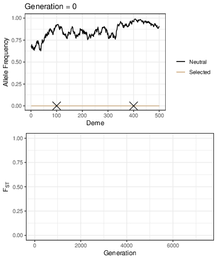
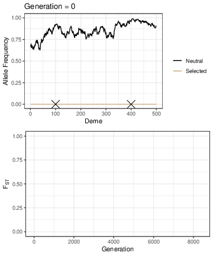
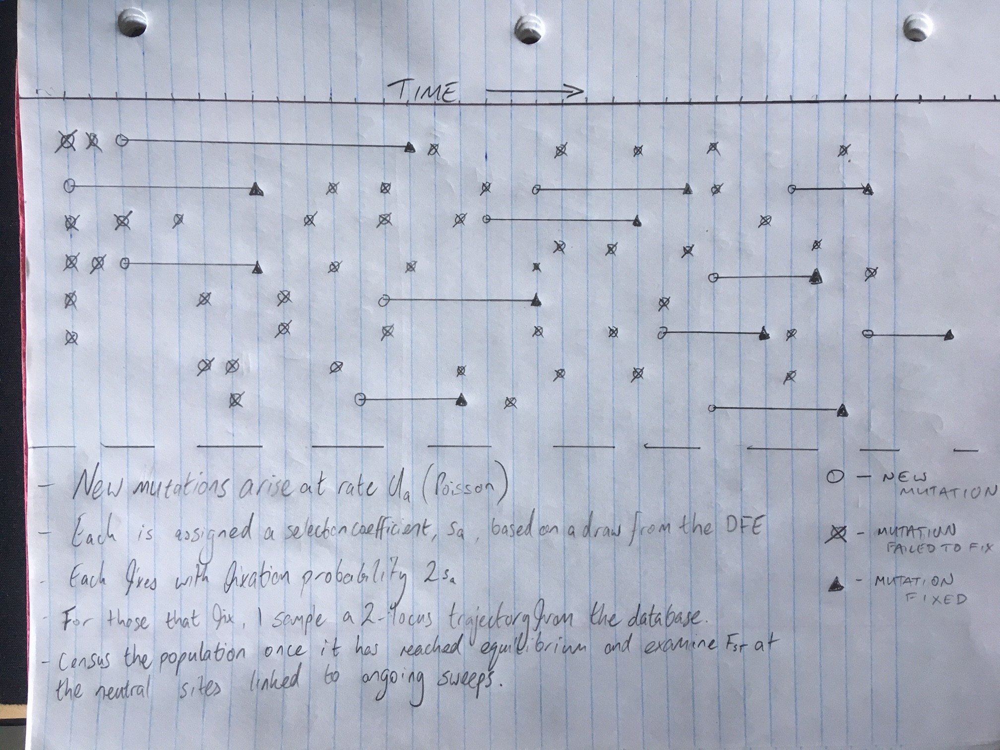

Stepping Stone Simulations
======

Here I give a more informal description of what I did for the stepping-stone simulations. The code should all be present and hopefully easy(ish) to follow. If you have any questions I would be happy to hear from you.

[Check out this small example](example.md) to see which scripts I used when.

I approximated the spread of beneficial mutations in continuous environments using a one-dimensional stepping-stone model with many demes. Doing a full simulation with neutral and selected sequence, randomly introduced mutations and recombination like I did for the paraptry case wasn't feasible with such a large number of individuals, so I opted for a two-locus model instead.

Check out the manuscript for full details of the simulation, but to understand the structure of what I did a bit of explanation is needed. Simulating the mutation and subsequent equilibration of neutral variants in a stepping-stone population of 2.5 million individuals would take a very long time, so I took a little bit of a short cut. The initial paper describing the stepping-stone model (Kimura and Weiss 1964) showed that the correlation in allele frequencies between adjacent demes can be very high. I wanted to simulate popualtions with a distribution of *Fst* at neutral sites which was similar to what is seen in real organisms. Often within species pair-wise *Fst* is less than 0.1, so I played around a bit and settled on a migration rate of *m* = 0.[666](https://www.youtube.com/watch?v=WxnN05vOuSM). This gave me a [distribution of *Fst*](img/NeutralFst.pdf) between demes which I was happy with. Weiss and Kimura (1964) showed that the correlation in allele frequencies between immediately adjacent demes with such a migration rate is very high (around 0.99). To short-cut the burn-in you would need to equilibrate neutral allele frequencies, I set the allele frequency in a randomly chosen deme using a random uniform draw. Moving in either direction from the chosen deme, allele frequencies were set by sampling correlated values assuming a correlation of 0.99. Once that was done, I did 100,000 generations of drift to get the popualtion to equilibrate. Simulations where the neutral allele was lost were discarded. I generated a database with 100,000 neutral allele frequency profiles.

Simulating the spread of beneficial mutations was much simpler. I would grab a neutral simulation and drop a selected mutation into a randomly chosen deme. The genotype frequnecies at the selected and neutral loci were recorded for all generations in which the selected site was segregating. Like above, I discarded each simulation where the selected allele was lost. I repeated this process 200 times for each value of *s* between 0.0001 and 0.01 (in increments of 0.0001) and recorded the genotype freuqency traces in a big database. For each replicate, I can examine the change in allele frequency at the selected or the neutral site. Each simulation replicate gave me something like the following:



or



Next, I simulated recurrent sweeps in a haploid population by sampling the database of selection simulations as follows:

Each generation:
- A randomly chosen number of new beneficial mutations occurs in the population (*Ua*)
- Each mutation is assigned a selection coefficient based on a draw from the DFE (in the study I assumed an exponential DFE)
- Each mutation fixes with probability *2s*, those that don't are ignored
- For the mutations that fix, I sample a mutation from the database with the appropriate selection coefficient 

This process is repeated for 100,000 generations and at the end I census the population, and look at the distribution of *Fst* at the neural sites linked to ongoing sweeps.

Here's a description of the simulation from my jotter:


Making Figure S4
-----
This figure was quite straightforward to make. I just took the results from each of the DFE sampling runs that I had performed and plotted them using ```ggplot2```. The plotting script [PlotFstOutliers.R](bin/PlotFstOutliers.R) contains the code I used to generated Figure S4.

