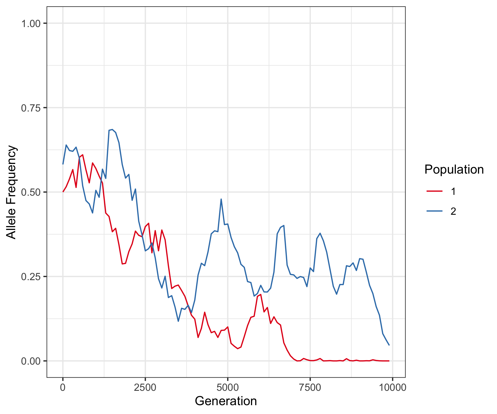

Here is a quick demonstation of how you might use the scripts in the ../bin/ directory to perform a quick simulation of drift in a parapatric population.

```
 python2.7 ../bin/drifter.py -k 2 -N 10000 -m 0.0001 -p 0.5 -d 10000 -o driftedPop.csv --store


```
The above command, should (fingers crossed!), perform a simulation of drift for a set of 2 parapatric demes with the of 10,000 individuals each. 
The parameter info is available by invoking ``` python2.7 ../bin/drifter.py -h```. 
The command above has:
	N = 10000 diploids per deme
	m = 0.0001 probability of migration in either direction
	p = 0.5 the initial frequency of the neutral allele
	d = 10,000 generations of drift
The output file contains the allele frequency every 100 generations and can be used to make a plot like this:


Invoking the ```plotDriftSims.R``` script makes the plot above. E.g:
```
Rscript plotDriftSims.R 
```


